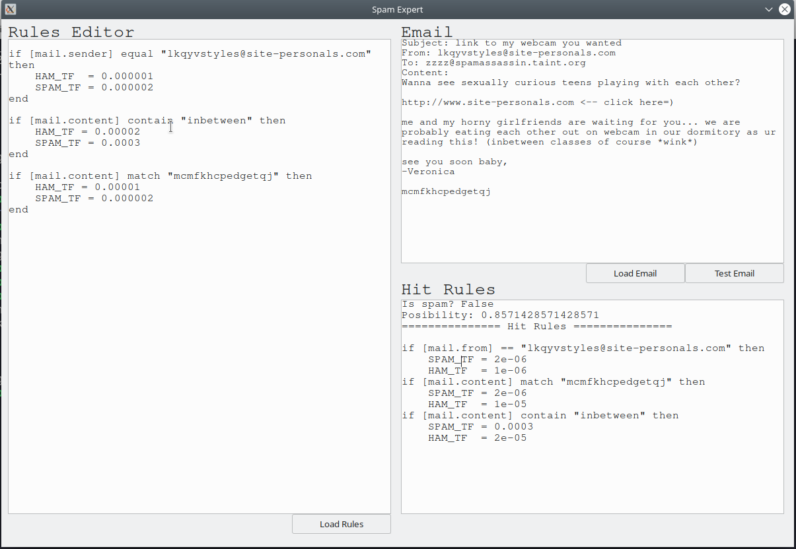

## NOSPAM

> 一个贝叶斯邮件检测的专家系统

### 特性

* 图形界面
* 支持自定义规则
* 内置一个方便编写规则的 DSL

### 截图



### 如何运行

```bash
pip install -r requirements.txt
python main.py
```

> Note: Python >= 3.7

### 规则编写

规则编写十分容易，根据贝叶斯邮件检测的原理，内置了一个规则解释器主要语法为

```nospam
if [mail.field] <operator> "pattern" then
    SPAM_TF = <number>
    HAM_TF  = <number>
end
```

* `[mail.field]` 主要有 `[mail.subject]`, `[mail.sender]`, `[mail.content]` 分别表示「邮件主题」，「发件人」和「内容」，可以自行拓展
* `<operator>` 主要有 `contain`, `match`, `equal` 分别表示「含有」，「匹配」和「相等」。
    * 「含有」表示给定的邮件字段含有关键词
        例如：
    * 「匹配」表示给定的邮件字段与某种模式匹配（正则规则）
    * 「相等」表示给定的邮件字段与关键词相等
* `"pattern"` 是一种模式，用字符串表示
* `SPAM_TF` 和 `HAM_TF` 是贝叶斯邮件检测中的两个参数
    * `SPAM_TF` 为垃圾邮件时，出现 `"pattern"` 的概率
    * `HAM_TF` 为正常邮件时，出现 `"pattern"` 的概率

#### 一些编写规则的例子

1. ”拉黑“ 某个邮件地址
```nospam
if [mail.sender] equal "some@one.org" then
    SPAM_TF = 1.0
    HAM_TF  = 0.0
end
```

2. 根据邮件具有的模式分类
```nospam
if [mail.subject] match "some\w+pattern\d+" then
    SPAM_TF = 0.002
    HAM_TF  = 0.001
end
```

3. 根据邮件包含的关键词分类
```nospam
if [mail.content] contain "sex" then
    SPAM_TF = 0.9
    HAM_TF  = 0.01
end
```